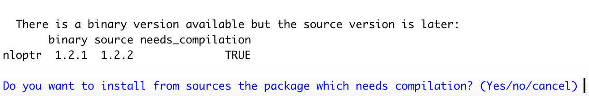

# [Home](README.md)
Acknowledgements: This MonashHonoursStatistics git repo is forked from Josh Wiley's original repo. Dr. Wiley created this course and much of the material remains his original work, with a few updates (mostly R related) for the current 2021 course.

The vision of this unit is to train you in applied statistics and data
science for Psychology. These skills are useful not only for
quantitative research but also are highly in demand industry/job
skills. With industry and modern, agile teams in mind, we will be
using several tools that are common tools used in industry. Some of
these you may have used, some may be new. We'll introduce each.

# 1. Microsoft Teams -- team communication

Teams is an instant messaging / chat platform. It allows easier, real time communication, sharing
code, files, and images than email. A channel that sits under the "PSY Honours 2021" Team called "PSY4210 - Data Science Forum" has been created, and if you are enrolled in the unit, you will automatically be added to the channel.


Although Moodle forums also will be available (and all official announcements will be made on both Teams and Moodle), Teams provides easier
real time interactions that are closer to how real teams work and
operate. Please feel free to chat openly, ask and answer questions
with each other in this space. If you need specific help from one of
the teachers you can use "@name" to mention them specifically and tag
them to look at a particular message.

# 2. GitHub -- collaborative code

GitHub is an amazing platform and tool for building software, storing
and managing code with over 40 million people actively using it.
GitHub performs **version control** which just means keeping a history
of all changes to a file, and lets you store and share files. By
keeping a history, multiple people can work on files and then merge or
combine their changes so it is common to use it for software
development. Although its very powerful, in this unit, we will just
introduce it and use it in a simple way. The lecture content and other
support resources (worksheets, etc.) will be made available through
GitHub. To use GitHub for this unit, follow these steps:

1.  Create an account [here](https://github.com/), 
    or if you already have an account, just sign in.

2.  Once you are signed up, download the desktop app
	[here](https://desktop.github.com/).
	
3.  Go to the repository (a collection of files and folders in GitHub)
    for PSY4210, located
    [here](https://github.com/michellebyrne1/MonashHonoursStatistics).
	Then click on "Clone or download" to get all the files synced to
    your own computer.
	
4.  Make sure to regularly "pull" (download) the latest version to
    your computer. We will update files regularly, for example adding
    the latest information for later lectures and updating or
    clarifying any materials as you all ask questions or find any
    errors. That is the whole beauty of GitHub: it lets files be
    edited and updated keeping a history but also letting you get the
    very latest versions.

# 3. Install and Setup `R`


`R` is primarily a language. To have a nicer way to
interact with and use `R` we will use RStudio. RStudio is known as an
*I*ntegrated *D*evelopment *E*nvironment or IDE. It is a program that
helps to keep your code, output, graphs, and files all together in one
place. *Please follow these steps on your own laptop/computer* so that
you can work on the unit and later in your studies or work 
from anywhere and do not depend on lab computers or a good internet
connection.

**As an alternative, if you are having trouble or cannot install `R`,
as a Monash member, you can access it through Monash MoVE
[here](https://move.monash.edu/).** When you login, choose "RStudio"
and you are ready to go.

*Note, with many of the instructions, especially on a Mac, a lot of
output code will be generated. You do not need to be able to read or
understand this and it is normal.*

## Windows OS

1.  **Download `R`** by going [here](https://cloud.r-project.org/) and
    clicking on "Download R for Windows" then click on "install R for the
	first time" which should let you "Download R **4.0.4** for Windows". 
	If you are having difficulty finding it, this link may help get you
	[straight there](https://cloud.r-project.org/bin/windows/base/).
	
2.  Once you have downloaded `R` double click the file to install it
    on your own computer. Follow the step by step installation guide
    that pops up.

3.  **Download RStudio** this is an interface to `R` and makes it much
    nicer to work with. To download it, just go
    [here](https://www.rstudio.com/products/rstudio/download/#download) 
	and then under the "Installers" pick your operating system
    (Windows 7+). 
	
4.  Once you have downloaded RStudio, double click to install it and
    follow the step by step installation guide.
	
5.  Once you think you've followed all the installation steps, move on
    to the next section to Try `R`.

## macOS

1.  The first step in getting `R` running on macOS is to make sure
    that you have the latest version of macOS. This is important as
    the installation process differs across versions.
	At the time of writing, the latest version is macOS Mojave
    10.14.6. You can get help with upgrading from Apple 
	[here](https://www.apple.com/au/macos/how-to-upgrade/).

2.  Install `X Code` from App Store. *After installation*, **open it** to
    accept terms otherwise it may not work. You can see a video guide
    [here](https://www.youtube.com/watch?v=DpEUllHV670).

3.  Once you have `X Code` installed, you also need to install command
	line tools. Open `Terminal` (if you cannot find it, try spotlight
	search) and type in: `xcode-select --install` then hit enter to
	run. See a video guide 
	[here](https://www.youtube.com/watch?v=AwZ_G6-pIVg).
	If you run into any access issues, you may need to enable
	root. You can do that by type in Terminal the following: 
	`dsenableroot` and hit enter/return to enable root user.
    *Note that at the terminal, if you are asked to enter a password,
    type the password you use to login to your Mac and press
    enter/return. When typing your password in the terminal, no
    characters will appear, but it is still being entered.*
	
4.  Install `XQuartz/X11`. Go 
	[here](https://www.xquartz.org/), download and run the file and
	follow any on screen instructions.

5.  Install `gfortran`: go 
    [here](https://github.com/fxcoudert/gfortran-for-macOS/releases)
    and download `gfortran 8.2 for Mojave`. Download and install
    following any instructions.

6.  Install `homebrew` for macOS. Go [here](https://brew.sh/) 
    and follow the "Install Homebrew" steps.
    If you run into any access issues, you may need to enable
	root. You can do that by type in Terminal the following: 
	`dsenableroot` and hit enter/return to enable root user.
    *Note that at the terminal, if you are asked to enter a password,
    type the password you use to login to your Mac and press
    enter/return. When typing your password in the terminal, no
    characters will appear, but it is still being entered.*
	
7.  Install `openssl` which will allow `R` to securely download files
    and packages from the internet.  Do this by opening the terminal
    (you can search for "terminal" or look in the launchpad) and type
    this code once the terminal opens and press enter: 
	`brew install openssl`

8.  Install `libgit2` which is needed for one of our graphing
    packages. Do this by opening the terminal
    (you can search for "terminal" or look in the launchpad) and type
    this code once the terminal opens and press enter:
	`brew install libgit2`

9.  **Download `R`** by going [here](https://cloud.r-project.org/) and
    clicking on "Download R for (Mac) OS X" then download the download
    version **3.6.3**. Once you have downloaded `R` make sure to
    install it to your apps.

10. **Download RStudio** this is an interface to `R` and makes it much
    nicer to work with. To download it, just go
    [here](https://www.rstudio.com/products/rstudio/download/#download) 
	and then under the "Installers" pick your operating system. 
	Once you have downloaded RStudio, make sure to install it to your
    apps. 
	
11. Make sure that `R.app` and `RStudio.app` are able to access disk
    resources needed. Follow
	[this guide](https://www.r-bloggers.com/escaping-the-macos-10-14-mojave-filesystem-sandbox-with-r-rstudio/)
	to give them the necessary permissions.
	
12. Install `clang`: go to `R` page
	[here](https://cran.rstudio.com/bin/macosx/tools)
	From there, download and install `clang-7.0.0.pkg`.
	**do not install clang-8** as that is for the beta version of
	`R`.

13. Once you think you've followed all the installation steps, move on
    to the next section to Try `R`.

# 4. Try `R`

To make sure that `R` and RStudio are installed and working correctly,
follow these steps:

1.  Find and open RStudio on your computer.  *On Windows OS this
    should be under all of your programs/applications (on Windows 10
    open the start menu and search for RStudio).  On macOS you can
    try spotlight search, but if it installed but does not show on
    spotlight search, try looking in the launchpad.* Once you have
    RStudio opened, there should be several "windows".
	
2.  Go to the window named "Console" and click at the prompt. The
    prompt is just this symbol: ">".
	
3.  At the console prompt, type this code and then press "enter"/"return":

```r 

3 + 1

```

If everything worked, `R` should return the answer, "[1] 4". 
_Note: the [1] just means that the answer, 4, is in position 1._
If not, double check the installation steps. If you are stuck, post on
the Moodle Discussion Forum promptly so we can help you figure things
out. 

Assuming everything is working, try to run this code at the console to
install a few packages we will be using this semester. 
`R` may generate a lot of output and strange code. Most of that is
OK. However, you should keep notes on any **Error** messages (just copy
and paste from the console) and raise these on the class discussion
boards if you are stuck. Note that you will not be using any of these
right now. Just try to run it so everything is installed and ready to
go. 

Please Post problems and errors to the discussion forum also will help
us troubleshoot so that in later weeks when we present analyses, you
have a fully functioning `R` on your system.

# 5. Learn about RStudio

To find out a bit more about RStudio, you can watch this <5 minute
[video](https://www.youtube.com/watch?v=V_NoBcxpYC8).

If you want something for future reference on RStudio,
try this 
[cheat sheet](https://github.com/rstudio/cheatsheets/raw/master/rstudio-ide.pdf).

# 6. DataCampe: Learn about `R`

To begin learning `R` we are going to be using the online platform,
DataCamp. Follow the instructions on Moodle for getting your account
setup. Then head over to [DataCamp](https://www.datacamp.com/), sign
in with your Monash account, and go to "My Class". Note the first 1-2
weeks will be fairly intense as to follow the class, you need to get
up to a basic ability to read and follow `R` code.

**The DataCamp activities are official homework and are assessed,
based on the number completed (full marks if all completed).**


# 5. Install `R` Packages

This section will have you pre-install many packages we will use
during the honours unit.

*Note*, during installation, you may get asked if you want to install
more recent packages from source or something like:
"there is a binary version available but the source version is later".
In `R`, **binary** packages are pre-built on servers and you download
a ready-to-use version. Like buy a complete bookshelf. Conversely,
**source** packages are the raw code and have to be built after you
download them. Your computer does this, like buying a bookshelf from
Ikea where you get the parts but spend some time putting it together.
In this unit, we do not need the very latest versions so getting the
binary version is fine and generally easier/faster. So for now, if
given the option to install from source, you can type "no". That said,
the reason you have to install so many other tools (like `clang`) is
so that your computer *has* all the tools need to build packages from
source, *just in case*. The goal is to get your machine setup as much
as possible so that during the semester you run into fewer issues
installing packages. Here is an example of what this might look like
while installing packages:



in that screenshot example, you would type at the console "no"
(without the quotes) and press enter/return at which point `R` should
install the binary version.

```r 

## some general language features, used in other packages
install.packages("rlang", dependencies = TRUE)

## for working with R and markdown files
install.packages("rmarkdown", dependencies = TRUE)

## general data management
install.packages("data.table", dependencies = TRUE) 

## data operations
install.packages("extraoperators", dependencies = TRUE) 

## read text files into R
install.packages("readr", dependencies = TRUE) 

## read Excel files into R
install.packages("readxl", dependencies = TRUE)

## read SPSS, STATA, and SAS files into R
install.packages("haven", dependencies = TRUE) 

## reshape data (for longitudinal datasets)
install.packages("reshape2", dependencies = TRUE) 

## beautiful graphs in R
install.packages("ggplot2", dependencies = TRUE) 

## create panels of plots in R
install.packages("ggpubr", dependencies = TRUE) 

## visreg app helps visualize regression models easily
install.packages("visreg", dependencies = TRUE)

## diagnostics and effect sizes for GLMs
install.packages("JWileymisc", dependencies = TRUE) 

## mixed effects models
install.packages("lme4", dependencies = TRUE) 

## mixed effects models diagnostics and effect sizes
install.packages("multilevelTools", dependencies = TRUE)

## multiple imputation
install.packages("mice", dependencies = TRUE) 

## load the packages (basically open/run the apps)
library(data.table)
library(extraoperators)
library(readr)
library(readxl)
library(haven)
library(reshape2)
library(ggplot2)
library(ggpubr)
library(visreg)
library(JWileymisc)
library(lme4)
library(multilevelTools)
library(mice)

```

The package installation may generate a lot of output. Finally loading
the packages (the `library()` code) will not do anything, although you
may get some notes or messages. If you do not receive any errors or
messages like 
"Error in library(readr) : there is no package called 'readr'"
That is considered a successful outcome of this step.

_Note that generally any text entered at the
console is assumed to be a command to `R`. The exception is that text
following a hashtag, #, is treated as a comment, not a command. This
is a helpful way to document code, so you know what the purpose of a
particular piece of code is._

# 6. Summary and Checklist

This module covers installing and setting up `R` and RStudio. You have
a functioning version of `R` on your own computer. Before the first
lecture, make sure you've done everything by going through this
checklist.

- [ ] `R` is installed
- [ ] RStudio is installed and you can open and use it to add numbers
- [ ] You have watched/read the basics about RStudio
- [ ] You are registered and can access DataCamp and/or have posted to
  Teams so we can make sure you have access to DataCamp
- [ ] You bring your laptop to every lecture and have RStudio open
  ready to follow along any activities.
- [ ] Packages have been installed and/or you have posted
  problems/errors to Teams
